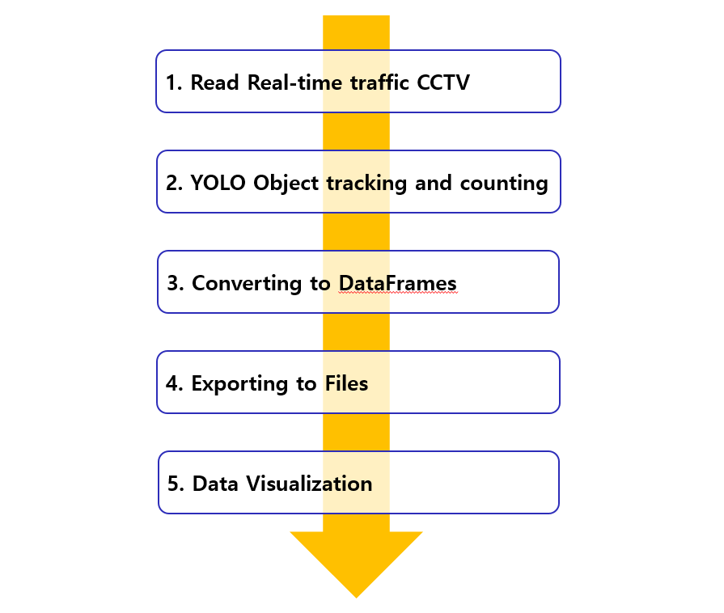

# <AI를 이용한 실시간 인천공항 IN/OUT 차량 수 집계>

[프로젝트 홈페이지 - https://YounJiYoon.github.io/cctv/](https://YounJiYoon.github.io/cctv/)

# 1. 프로젝트 개요

 인천공항은 국내외 중요한 교통 허브로, 이를 둘러싼 교통 흐름은 공항 운영의 효율성에 큰 영향을 끼친다. 특히 영종대교와 인천대교는 공항으로 향하는 주요 교통로로, 해당 도로의 실시간 교통 상태를 모니터링하는 것은 필수적이다. 교통량을 실시간으로 분석하고 예측하는 시스템이 필요하며, 이를 통해 공항의 혼잡도를 관리하고, 교통 체증을 완화하는 데 기여할 수 있다. 본 시스템은 CCTV 영상을 활용하여 차량을 실시간으로 감지하고 분석함으로써, 교통 흐름을 효율적으로 모니터링할 수 있는 방법을 제시하고자 한다.

# 2. 프로젝트 개발 환경

 

# 3. 프로젝트 결과

    
   
    
 
# 4. 알고리즘

 

1.데이터 수집: 국가교통정보센터 API를 통해 실시간 CCTV 영상을 수집하고, 경도와 위도를 지정하여 특정 CCTV 데이터를 가져옴.

2.영상 분석: OpenCV와 YOLO 딥러닝 모델을 사용하여 차량을 감지하고, 차량을 차종(CAR, TRUCK, BUS)별로 분류하고 추적. 차량 통과 방향을 추적하여 공항 IN/OUT을 구분. 

3.데이터 업데이트: 영상 분석을 통한 정보를 바탕으로 차량 수를 데이터프레임으로 업데이트.

4.데이터 저장: 업데이트된 데이터는 5분마다 CSV 파일로 저장.

5.데이터 시각화: 저장된 데이터를 matplotlib를 사용하여 시각화, 요일별 시간대에 따른 차량 수를 차종별 색상으로 막대 그래프로 나타내는 대시보드 제공.

 
 
# 5. 본인 소개

|이름 |고길동|| 
|연락처 | gdko(@)dongyang.ac.kr| 
|skill set| Frontend - HTML, CSS, Javascript| 
| | Backend - Java, Spring, Oracle| 
|자격증| 20xx년 정보처리기사 | 
|| 20xx년 빅데이터분석기사 | 
|| 20xx년 SQLD | 
|| 20xx년 ADsP | 
|수상| 20xx년 프로젝트 대상 수상 (과학기술정보통신부 지원)  | 
| | 20xx년 한국전자전 동양미래엑스포 대상 수상| 
| | 20xx년 대학생 논문 경진대회 은상 수상| 
|특기사항|  TOEIC 990 | 

